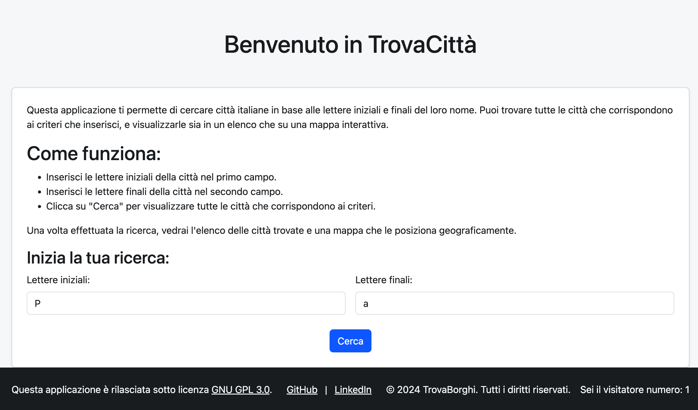
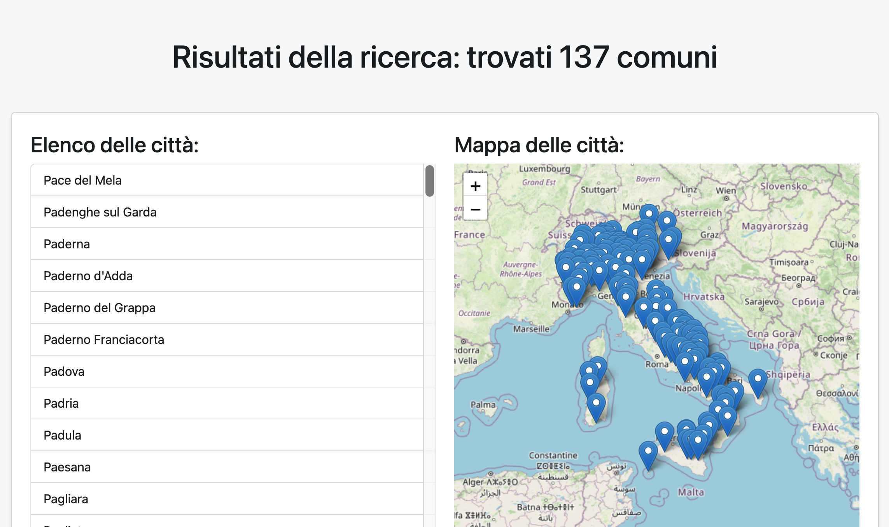

# TrovaBorghi

TrovaBorghi è un'applicazione web che permette di cercare città italiane in base alle lettere iniziali e finali del loro nome. L'app visualizza i risultati sia in formato testuale che su una mappa interattiva, grazie all'integrazione di **Folium**.

## Funzionalità principali

- **Ricerca di città**: Cerca città italiane inserendo lettere iniziali e finali.
- **Mappa interattiva**: Visualizza le città trovate su una mappa dinamica.
- **Responsive design**: Utilizzo di Bootstrap per garantire un'interfaccia user-friendly su dispositivi di tutte le dimensioni.
- **Contatore degli accessi**: Mostra il numero di accessi all'applicazione.

## Tecnologie utilizzate

- [Flask](https://flask.palletsprojects.com/) - Microframework per il backend Python.
- [Folium](https://python-visualization.github.io/folium/) - Libreria per la visualizzazione delle mappe.
- [Bootstrap](https://getbootstrap.com/) - Framework front-end per lo stile e il layout responsive.
- [Python](https://www.python.org/) - Linguaggio di programmazione utilizzato per il backend.

## Installazione locale

Segui questi passaggi per eseguire l'applicazione in locale:

1. Clona il repository GitHub:
    ```bash
    git clone https://github.com/CheckSim/TrovaBorghi.git
    cd TrovaBorghi
    ```

2. Crea un ambiente virtuale (opzionale ma consigliato):
    ```bash
    python -m venv venv
    source venv/bin/activate  # Su Windows usa `venv\Scripts\activate`
    ```

3. Installa le dipendenze:
    ```bash
    pip install -r requirements.txt
    ```

4. Avvia il server Flask:
    ```bash
    flask run
    ```

5. Apri il browser e vai all'indirizzo:
    ```
    http://127.0.0.1:5000/
    ```

## Come usare l'app

1. **Inserisci i criteri di ricerca**: Nella home page, inserisci le lettere iniziali e finali delle città che vuoi cercare.
2. **Visualizza i risultati**: Dopo aver premuto il pulsante "Cerca", verranno visualizzate le città che corrispondono ai criteri, insieme alla loro posizione su una mappa.
3. **Controlla il contatore**: Nel footer della pagina è presente un contatore che mostra il numero totale di accessi all'app.

## Esempio di utilizzo

Se inserisci "Pa" come lettere iniziali e "a" come lettere finali, verranno visualizzate città come **Padova**, **Pavia**, ecc., insieme alla loro posizione sulla mappa.

## Screenshot




## Contributi

Se desideri contribuire al progetto, sentiti libero di fare una **pull request**. Le discussioni sono benvenute per migliorare l'applicazione.

### Come contribuire

1. Fai un fork del progetto.
2. Crea un branch per le tue modifiche (`git checkout -b feature/nome-della-feature`).
3. Commit delle tue modifiche (`git commit -am 'Aggiungi una nuova feature'`).
4. Pusha il branch (`git push origin feature/nome-della-feature`).
5. Apri una **pull request**.

## Licenza

Questa applicazione è rilasciata sotto licenza **GNU GPL 3.0**. Puoi consultare il file [LICENSE](https://www.gnu.org/licenses/gpl-3.0.it.html) per ulteriori informazioni.

---

&copy; 2024 TrovaBorghi. Tutti i diritti riservati.
